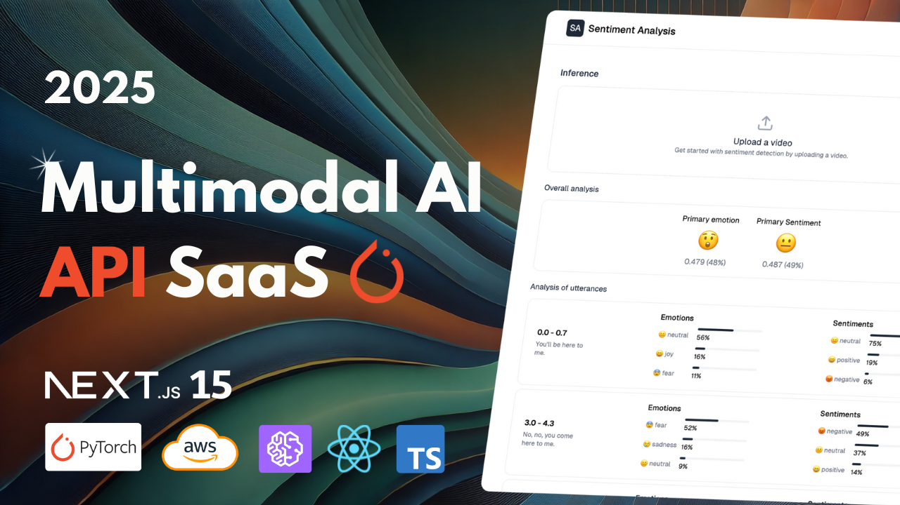

[https://youtu.be/Myo5kizoSk0](https://youtu.be/Myo5kizoSk0)

## Overview

Hi 🤙 In this video, you'll learn how to build a multimodal AI model using PyTorch. The model will accept a video as its input, and predict its sentiment and emotion. When training the model, you'll build features like text, video, and audio encoding, multimodal fusion, and emotion and sentiment classification. After training and deploying the model, you'll build a SaaS around your trained model, where users can run inference on their videos through your API. You'll set up invocation of the deployed model with SageMaker Endpoints, and manage the monthly quotas users have. The SaaS will be built with technologies such as Next.js, React, Tailwind, and Auth.js and is based off of the T3 Stack. You'll be able to build along with me from start to finish.

Features:

- 🎥 Video sentiment analysis
- 📺 Video frame extraction
- 🎙️ Audio feature extraction
- 📝 Text embedding with BERT
- 🔗 Multimodal fusion
- 📊 Emotion and sentiment classification
- 🚀 Model training and evaluation
- 📈 TensorBoard logging
- 🚀 AWS S3 for video storage
- 🤖 AWS SageMaker endpoint integration
- 🔐 User authentication with Auth.js
- 🔑 API key management
- 📊 Usage quota tracking
- 📈 Real-time analysis results
- 🎨 Modern UI with Tailwind CSS

## Setup

Follow these steps to install and set up the SaaS project:

### Installation

1. Clone the repository

```bash
git clone https://github.com/yourusername/ai-video-sentiment-saas.git
cd ai-video-sentiment-saas
```

2. Install dependencies

```
npm install
```

3. Configure environment variables in .env:

```
DATABASE_URL="your-database-url"
AUTH_SECRET="your-auth-secret"
AWS_REGION="your-aws-region"
AWS_ACCESS_KEY_ID="your-access-key"
AWS_SECRET_ACCESS_KEY="your-secret-key"
```

4. Initialize the database:

```
npm run db:generate
npm run db:push
```

## Running the app

### Development

```
npm run dev
```

### Production

```
npm run build
npm start
```
